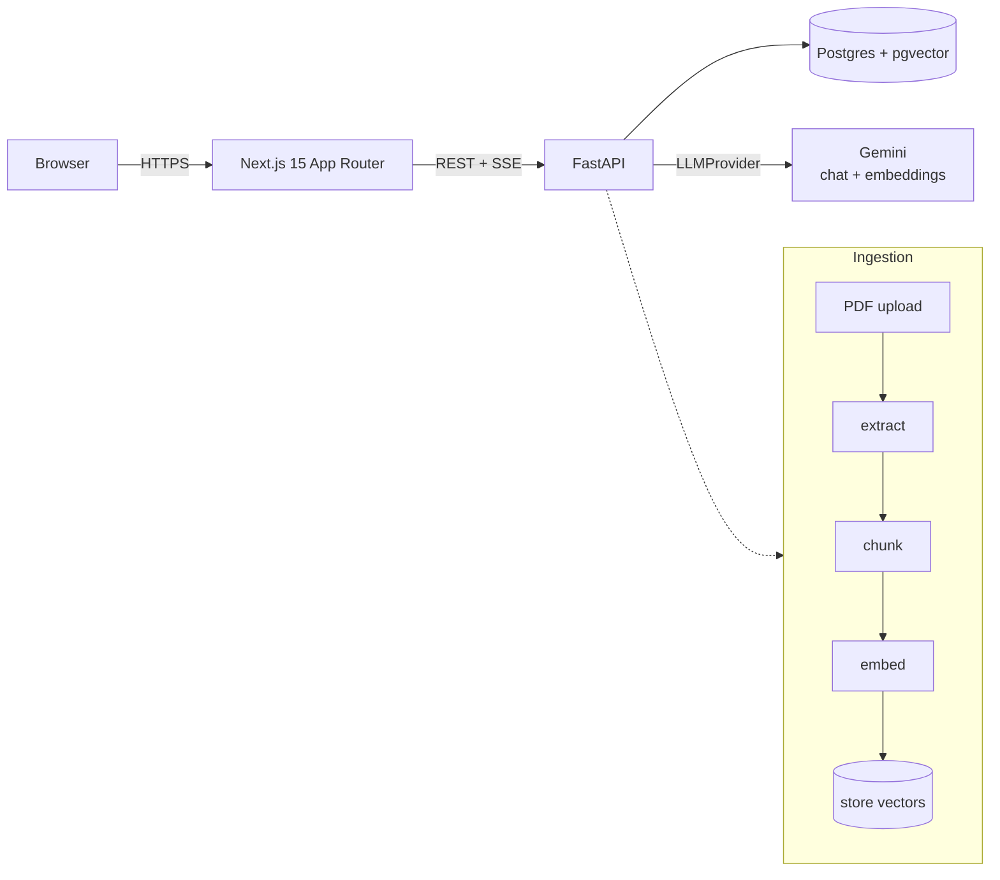

# DocLens — AI Document Intelligence Platform

[](https://github.com/Hasse93/doclens/actions/workflows/ci.yml)


DocLens reads uploaded documents, indexes them for semantic search, and answers
questions with **citations back to the exact page**. It is built around a single
RAG engine designed to serve two modes from the same core:

- **Research mode** *(implemented)* — understand academic papers: summaries,
  citation-grounded Q&A, and schema-validated structured extraction.
- **Recruitment mode** *(implemented)* — rank résumés against a job description
  with explainable scoring (matched / missing skills and a recommendation).

The pipeline — extract → chunk → embed → store → retrieve — is identical for
both modes. Only the prompts, the extraction schema, and the output view change.

> **Live demo:** **https://doclens-ecru.vercel.app** &nbsp;·&nbsp; API: https://doclens-api.onrender.com/docs
> _Hosted on free tiers: the backend (Render) sleeps when idle, so the first
> request after a while takes ~30–50s to wake, and the free Postgres is
> time-limited. Both are platform constraints, not app issues._

## Architecture



The pipeline above is shared by both modes; only the prompts, the extraction
schema, and the output view differ.

| Concern        | Choice                                       |
| -------------- | -------------------------------------------- |
| Frontend       | Next.js 15, React 19, TypeScript, Tailwind   |
| Backend        | FastAPI, SQLAlchemy 2                         |
| Database       | PostgreSQL with the `pgvector` extension     |
| PDF parsing    | PyMuPDF                                       |
| LLM/embeddings | Gemini, behind an `LLMProvider` interface    |
| Auth           | JWT (bearer tokens)                          |

The `LLMProvider` abstraction (`backend/app/core/llm`) means no application code
imports a vendor SDK directly — switching providers is a config change.

## Running with Docker (recommended)

1. Get a Gemini API key from <https://aistudio.google.com/app/apikey>.
2. From the project root, create a `.env` file:

   ```env
   GEMINI_API_KEY=your-key-here
   JWT_SECRET=a-long-random-string
   ```

3. Start everything:

   ```bash
   docker compose up --build
   ```

4. Open the app at <http://localhost:3000>. The API docs are at
   <http://localhost:8000/docs>.

### Sample documents

To try the app quickly, fetch a few open-access papers from arXiv:

```bash
python scripts/fetch_samples.py
```

They land in `samples/` (gitignored). See [samples/README.md](samples/README.md)
for the list. These are demo inputs only — DocLens does not train on them.

## Running locally without Docker

**Backend**

```bash
cd backend
python -m venv .venv && source .venv/bin/activate   # Windows: .venv\Scripts\activate
pip install -r requirements.txt
cp .env.example .env        # then fill in GEMINI_API_KEY and a local DATABASE_URL
uvicorn app.main:app --reload
```

You need a Postgres instance with the `vector` extension available. The easiest
option is to run just the database from Docker:

```bash
docker compose up db
```

**Frontend**

```bash
cd frontend
npm install
cp .env.local.example .env.local
npm run dev
```

## Deployment

The backend (FastAPI + Postgres/pgvector) and frontend (Next.js) deploy
separately — backend on a container host such as Render, frontend on Vercel.
A Render blueprint ([`render.yaml`](render.yaml)) and step-by-step instructions
are in [DEPLOYMENT.md](DEPLOYMENT.md). The backend reads `CORS_ORIGINS` and
tolerates managed `postgresql://` connection strings, so it runs unchanged in
the cloud.

## How it works

1. **Upload** — a PDF is accepted and the document record is created as
   `pending`; processing runs in the background.
2. **Process** — text is extracted per page, split into overlapping chunks,
   embedded, and stored in `pgvector`. A summary is generated. Status becomes
   `ready` (or `failed`, with the reason recorded).
3. **Ask** — a question is embedded and matched against the document's chunks by
   cosine distance; the top passages are sent to the model, which answers and
   cites passages as `[n]`. The API returns the answer plus the page each
   citation came from.
4. **Extract** — structured fields are pulled and validated against a Pydantic
   schema, so the response always has the documented shape.

### Recruitment mode

Upload a job description (role `job`) and one or more résumés (role `resume`),
then score them. Each résumé is matched against the JD with two signals:

- **Semantic similarity** — cosine distance between the JD and résumé
  embeddings (reuses the same embedding model as retrieval).
- **LLM judgement** — an explainable assessment returning matched skills,
  missing skills, and a short recommendation, validated against a schema.

The two combine into a single 0–100 score and the résumés are returned ranked.
Results are persisted, so re-running replaces the previous set.

### Notes, export, and multi-document Q&A

- **Notes** — save free-text notes on any document.
- **Report export** — download a report (summary + structured data + notes) as
  **Markdown or PDF**.
- **Multi-document Q&A** — ask one question across several research documents at
  once; each citation names the source **document and page**.

### Conversational chat

- **Streaming answers** — the per-document chat streams tokens over
  Server-Sent Events for a live typing effect.
- **Persisted history** — each question and grounded answer is saved, so a
  conversation survives a page reload (and can be cleared).

## Evaluation harness

`backend/eval` measures retrieval and answer quality against a labelled question
set over the sample papers — the kind of check that keeps a RAG system honest.

```bash
cd backend
python -m eval.run_eval --pace 5   # needs GEMINI_API_KEY + fetched samples
python -m eval.run_eval --fake     # smoke-test the harness without a key
```

It reports **retrieval hit-rate** (did the retrieved passages contain the
expected information?) and **answer accuracy** (did the generated answer?).

Latest run (Gemini, 9 questions across the four sample papers):

```
Retrieval hit-rate : 9/9  (100%)
Answer accuracy    : 9/9  (100%)
```

> On the Gemini **free tier**, embedding a whole paper at once can exceed the
> per-minute token limit (HTTP 429). `--pace N` embeds one chunk every `N`
> seconds to stay under it; the provider also retries with backoff. On a paid
> key you can drop `--pace`.

## Project layout

```
backend/
  app/
    api/routes/      # auth, documents, chat, notes, recruitment
    core/
      llm/           # provider interface + Gemini implementation
      rag/           # extractor, chunker, retriever, prompts
      security.py    # hashing + JWT
    models/          # SQLAlchemy models
    schemas/         # Pydantic request/response models
    services/        # ingestion, chat, extraction, recruitment, report
  eval/              # retrieval/answer evaluation harness + dataset
  tests/             # end-to-end integration test
frontend/
  app/               # routes (login, register, dashboard, document view, ask, recruitment)
  components/         # UI building blocks
  lib/               # API client, auth context, types
scripts/             # fetch_samples.py (downloads demo PDFs)
samples/             # demo PDFs (gitignored) + manifest
```

## Roadmap

- [x] Phase 1 — Research mode: auth, upload, RAG Q&A with citations, summary,
      structured extraction.
- [x] Phase 2 — Recruitment mode (JD ↔ résumé matching with explainable scoring)
      and a retrieval evaluation harness.
- [x] Phase 3 — Saved notes, Markdown report export, and multi-document Q&A.
- [x] Extras — streaming chat, persisted conversation history, PDF export, and
      deployment config (see [DEPLOYMENT.md](DEPLOYMENT.md)).
